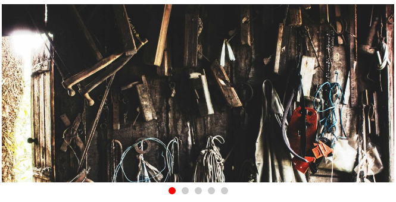
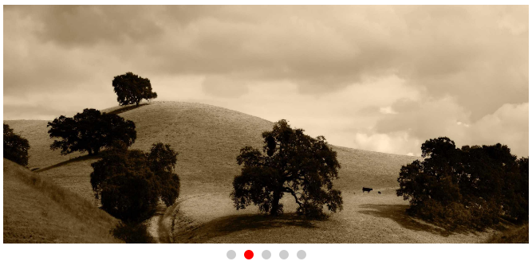
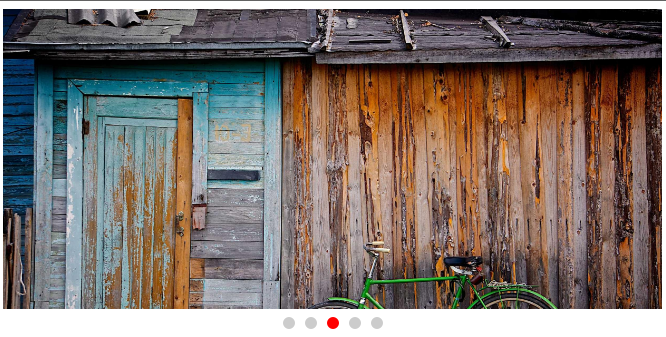
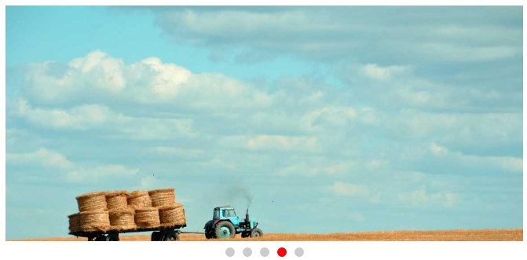
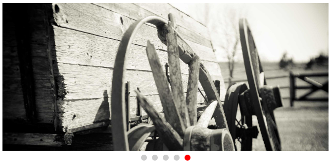

#  CARROSSEL

Nessa aplicação desenvolvida em `Angular: 14.2.5` e `typeScript`, estamos criando um carrossel de imagem.

Carrossel é um componente essencial no designe de um site. Ele ajuda a exibir diversas informações em um espaço limitado.

Foi feito também `botões de controle`, para que o usuário possa escolher aleatoriamente uma imagem.

## Considerações:
    - A construção deste componente evolveu o conhecimento em Angular e também um pouco de HTML e CSS.

ScreenShot - Primeira imagem da galeria.

ScreenShot - Segunda imagem da galeria.

ScreenShot - Terceira imagem da galeria.

ScreenShot - Quarta imagem da galeria.

ScreenShot - Quinta imagem da galeria.

<h1 align="center">💻 Desenvolvido Por: Gilberto Júnior</h1>